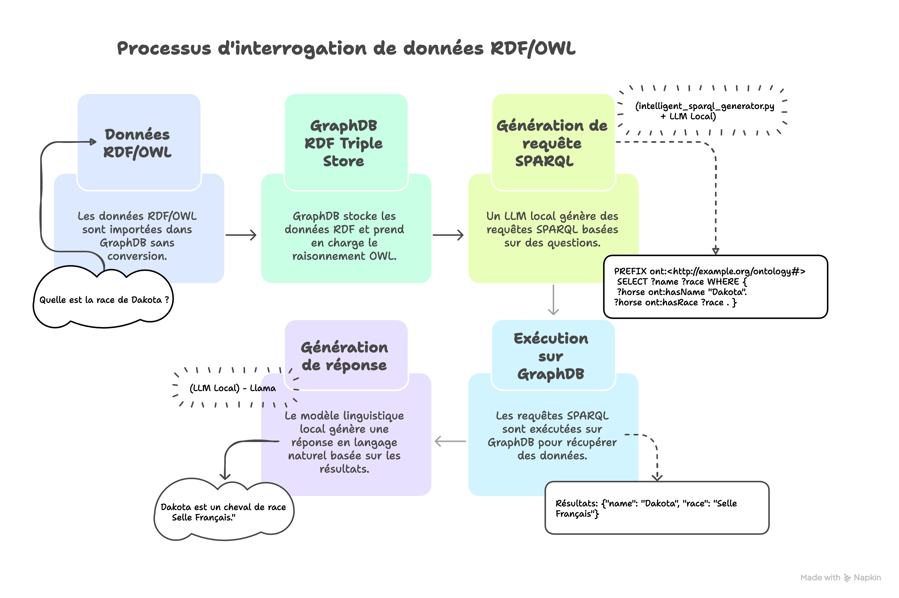

# Graph RAG Pipeline — GraphDB, Local LLM & RDF

Equestrian knowledge-graph chatbot: **natural language → SPARQL → GraphDB → context → natural language answer**. Uses a local LLM (LM Studio / OpenAI-compatible) or OpenAI, with optional dual models (one for SPARQL, one for French answers).

---

## Architecture (high level)




- **GraphDB:** RDF repository (ontology + instance data).
- **Local LLM:** OpenAI-compatible API (e.g. LM Studio) at `http://localhost:1234/v1`.
- **Config:** Single model for both steps, or two models (SPARQL + answer). See [docs/LLM_CONFIGURATIONS.md](docs/LLM_CONFIGURATIONS.md).

---

## Prerequisites

- **Python 3.10+**
- **GraphDB** running with a repository and data loaded (ontology + RDF).
- **Local LLM server** (e.g. LM Studio) exposing an OpenAI-compatible `/v1/chat/completions` endpoint, **or** OpenAI API key for evaluation (semantic + LLM-judge).

---

## Quick start

### 1. Clone and install

```bash
git clone <this-repo-url>
cd SportLMM_Project_pipeline_GraphDB
pip install -r requirements.txt
```

### 2. Configure

Copy `.env.example` to `.env` and set:

- `GRAPHDB_ENDPOINT` — e.g. `http://localhost:7200/repositories/equestrian-kg`
- `LOCAL_LLM_ENDPOINT` — e.g. `http://localhost:1234/v1`
- `LOCAL_LLM_MODEL` — one model for both tasks, **or**
- `SPARQL_LLM_MODEL` and `ANSWER_LLM_MODEL` — separate models for SPARQL and answers  
- `ONTOLOGY_NAMESPACE` — your ontology namespace (default in `.env.example`)

Optional for evaluation: `OPENAI_API_KEY` (for semantic + LLM-judge).

### 3. Load data into GraphDB

- Import `data/ontology.owl` and `data/Horse_generatedDataV2.rdf` into your GraphDB repository (or use your own ontology and RDF).

### 4. Run the chatbot

```bash
cd code
python intelligent_chatbot.py
```

Interactive loop: type questions in French; the pipeline shows SPARQL (if `SHOW_SPARQL=true`) and the answer.

### 5. Check configuration

```bash
cd code
python config.py
```

Prints current LLM/GraphDB/ontology settings and validates required variables.

---

## Evaluation results (for supervisors)

**All evaluation outputs (RAGAS + semantic + LLM-judge) are in the folder:**

**[`evaluation_results/`](evaluation_results/)**

- **RAGAS/** — RAGAS metrics for 6 model configurations (test1–test6): `eval_results_test1_qwen_llama.json` … `eval_results_test6_GPT-OSS-20B_unified.json`.
- **Semantic + LLM-judge** — `semantic_evaluation_20260129_215817_pipeline_graphdb.json` (40 questions, overall and per-category metrics).

See **[evaluation_results/README.md](evaluation_results/README.md)** for a short index and [docs/EVALUATION_RESULTS.md](docs/EVALUATION_RESULTS.md) for how the evaluations were run.

---

## Project layout (main branch)

```
.
├── README.md                 # This file
├── requirements.txt
├── .env.example
├── evaluation_results/       # Evaluation results (RAGAS + semantic) — for supervisors
│   ├── README.md             # Index of result files
│   ├── RAGAS/                # RAGAS runs (test1–test6)
│   └── semantic_evaluation_*.json
├── docs/
│   ├── IMPLEMENTATION.md     # What each file does
│   ├── LLM_CONFIGURATIONS.md # Single / dual / OpenAI configs
│   └── EVALUATION_RESULTS.md # Evaluation setup and results
├── code/
│   ├── config.py
│   ├── graphdb_client.py
│   ├── llm_client.py
│   ├── intelligent_sparql_generator.py
│   ├── context_builder.py
│   ├── intelligent_chatbot.py
│   ├── evaluation_service.py
│   ├── evaluation/
│   │   ├── evaluate.py
│   │   ├── run_semantic_evaluation.py
│   │   ├── add_ragas_scores.py
│   │   ├── compare_results.py
│   │   └── ...
│   └── evaluation_results/   # Script output (optional; main results in root evaluation_results/)
└── data/
    ├── ontology.owl
    ├── Horse_generatedDataV2.rdf
    └── french-graphrag-qa V2.md
```

---

## Evaluation

- **Semantic + LLM-judge:** `cd code && python evaluation/run_semantic_evaluation.py` (needs `OPENAI_API_KEY`).
- **RAGAS:** `cd code && python evaluation/evaluate.py` (needs `ragas`, `datasets`, and a test dataset).
- **Add RAGAS to existing run:** `python evaluation/add_ragas_scores.py path/to/results.json`.
- **Compare runs:** `python evaluation/compare_results.py` (reads `code/evaluation_results/`).

**Published results (for supervisors):** [evaluation_results/](evaluation_results/) at repo root. Details and how to reproduce: [docs/EVALUATION_RESULTS.md](docs/EVALUATION_RESULTS.md).

---

## Documentation

| Doc | Content |
|-----|--------|
| [docs/IMPLEMENTATION.md](docs/IMPLEMENTATION.md) | File-by-file implementation guide |
| [docs/LLM_CONFIGURATIONS.md](docs/LLM_CONFIGURATIONS.md) | Single / dual local / OpenAI configs |
| [docs/EVALUATION_RESULTS.md](docs/EVALUATION_RESULTS.md) | Evaluation setup and where results are stored |
| [docs/GIT_INSTRUCTIONS.md](docs/GIT_INSTRUCTIONS.md) | How to create the repo and push main vs experiments branches |

---

## Branches

- **`main`** — Production pipeline (this layout: code, data, docs).
- **`experiments`** — Earlier experiments (exp_001–exp_005, etc.); see `experiments/README.md` on that branch.

---

## License

See repository settings. No additional license file is included by default.

